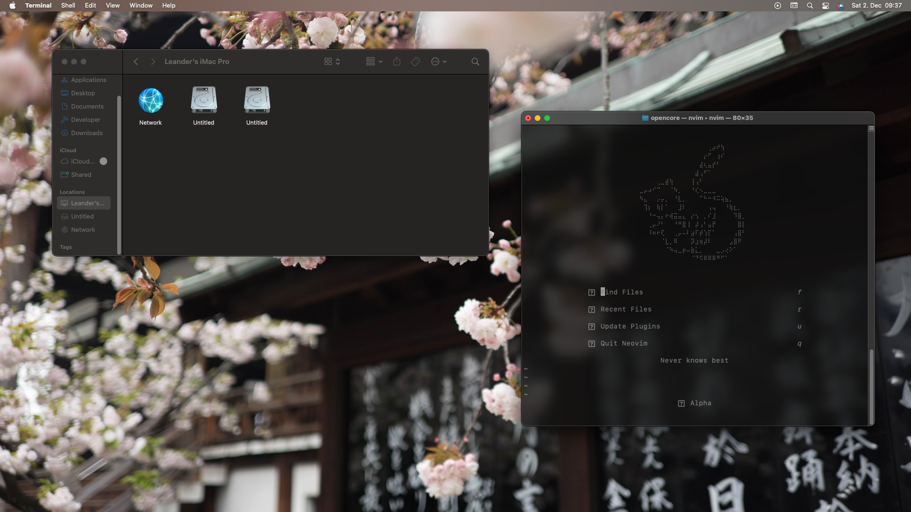

# opencore

My personal opencore configuration repository! This setup is tailored for the following hardware specifications:
## Specs:
- *CPU*: Intel i5-8400 Coffe Lake
- *GPU*: Asus ROG Strix-RX580-O8G-Gaming
- *Motherboard*: Gigabyte Z370P D3

## Features:
### Working:
- Sleep
- DRM Content
- Power Management
- iService
- USB Mapping
- Boot GUI

### Not working:
- Boot Chime (Not a priority) 
- Security Features: FileVault and Apple Secure Boot aren't enabled. However, i dont need these features.
